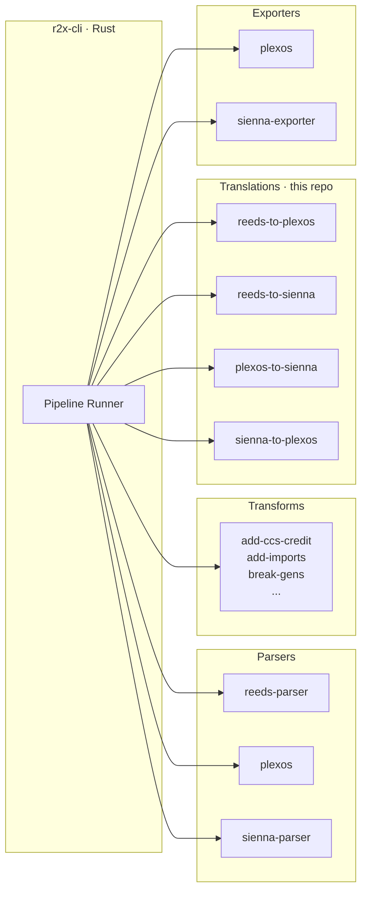

<h1 align="center">R2X</h1>
<p align="center">
Translation plugins for power system models.<br>
ReEDS, PLEXOS, Sienna
</p>

<div align="center">

[](https://pypi.python.org/pypi/r2x)
[](https://github.com/NatlabRockies/r2x/actions/workflows/ci.yaml)
[](https://codecov.io/gh/NatlabRockies/r2x)
[](https://natlabrockies.github.io/R2X/)
[](./LICENSE.txt)

</div>

<p align="center">
<a href="#installation">Installation</a> · <a href="#quick-start">Quick Start</a> · <a href="#architecture">Architecture</a> · <a href="#translation-plugins">Plugins</a> · <a href="#ecosystem">Ecosystem</a> · <a href="#model-compatibility">Compatibility</a> · <a href="#documentation">Docs</a> · <a href="#contributing">Contributing</a>
</p>

---

This repo houses the translation plugins for the
[r2x](https://github.com/NatlabRockies/r2x-cli) ecosystem. The
[r2x-cli](https://github.com/NatlabRockies/r2x-cli) is the
orchestrator for all r2x plugins — parsers, transforms,
translations, and exporters. It discovers installed plugins, chains
them into pipelines, and manages Python environments.

The plugins in this repo handle the translation step: converting
a parsed source system into a target format. They sit between
parsers (like `reeds-parser` or `sienna-parser`) and exporters
(like `plexos-parser` or `sienna-exporter`), all of which are separate
packages the CLI can chain together.

Translations are driven by declarative JSON rules that map source
components to target components, with `@getter`-decorated functions
handling any derived values.

## Installation

### Prerequisites

- Python 3.11, 3.12, or 3.13
- The [`r2x-cli`](https://github.com/NatlabRockies/r2x-cli)

### Install the CLI

See the [`r2x-cli` README](https://github.com/NatlabRockies/r2x-cli)
for install instructions. The CLI manages its own Python environment
and handles plugin installation.

### Install a translation plugin

Each plugin is published independently on PyPI. The CLI pulls in
any required dependencies (model packages, `r2x-core`, etc.)
automatically:

```bash
# Install via the CLI (recommended)
r2x install r2x-reeds-to-plexos
r2x install r2x-sienna-to-plexos

# Or install directly if managing your own environment
pip install r2x-reeds-to-plexos
```

Available plugins:

| Plugin | PyPI |
| --- | --- |
| `r2x-reeds-to-plexos` | [](https://pypi.python.org/pypi/r2x-reeds-to-plexos) |
| `r2x-reeds-to-sienna` | [](https://pypi.python.org/pypi/r2x-reeds-to-sienna) |
| `r2x-plexos-to-sienna` | [](https://pypi.python.org/pypi/r2x-plexos-to-sienna) |
| `r2x-sienna-to-plexos` | [](https://pypi.python.org/pypi/r2x-sienna-to-plexos) |

> [!TIP]
> We recommend [uv](https://docs.astral.sh/uv/) if you are managing
> Python environments yourself.

## Quick Start

### Using the CLI

The `r2x` CLI discovers all installed plugins automatically:

```bash
# List every plugin the CLI can see (parsers, transforms, translations, exporters)
r2x list

# Scaffold a pipeline template
r2x init

# Run a named pipeline
r2x run pipeline.yaml my-pipeline

# Preview without writing output
r2x run pipeline.yaml my-pipeline --dry-run

# Run a single plugin directly
r2x run plugin reeds-parser --show-help
```

A `pipeline.yaml` chains plugins from across the ecosystem.
Parsers, translations, and exporters can all live in the same
pipeline — the CLI pipes each step's output into the next:

```yaml
variables:
  run_folder: /path/to/reeds/run
  output_dir: output

pipelines:
  reeds-to-plexos:
    - r2x-reeds.reeds-parser           # from r2x-reeds
    - r2x-reeds-to-plexos.translation  # from this repo
    - r2x-plexos.plexos-exporter       # from r2x-plexos

config:
  reeds-parser:
    run_folder: ${run_folder}
    solve_year: 2050
    weather_year: 2012
  plexos:
    output: ${output_dir}
```

### Using the Python API

Each translation plugin exposes a `perform_translation` function
that takes a `PluginContext` and returns a translated `System`:

```python
import json
from importlib.resources import files

from r2x_core import PluginContext, Rule, System, apply_rules_to_context
from r2x_core.logger import setup_logging

setup_logging(level="INFO")

# Build a context with your source system and config
context = PluginContext(config=my_config)
context.source_system = source_system  # parsed ReEDS/PLEXOS/Sienna system

# Load and apply translation rules
rules_path = files("r2x_reeds_to_plexos.config") / "rules.json"
context.rules = Rule.from_records(json.loads(rules_path.read_text()))

# Run the rule engine
result = apply_rules_to_context(context)
result.summary()  # prints a rich table of per-rule results

translated_system = context.target_system
```

See each plugin's README under [`packages/`](./packages) for
complete examples.

## Architecture



The CLI runs any package that registers plugins via the `r2x_plugin`
entry point. It discovers them with `r2x list` and re-scans with
`r2x sync`.

A typical pipeline flows through three stages:

1. Parse — a parser plugin reads source data and produces an
   `r2x_core.System` (e.g. `reeds-parser` from
   [r2x-reeds](https://github.com/NatlabRockies/r2x-reeds)).
2. Translate — a translation plugin (this repo) applies JSON rules
   that map source components to target components, with `@getter`
   functions for computed fields.
3. Export — an exporter plugin writes the translated `System` to
   the output format (e.g. `plexos` from
   [r2x-plexos](https://github.com/NatlabRockies/r2x-plexos)).

Transform plugins (like `add-ccs-credit` or `break-gens` from
[r2x-reeds](https://github.com/NatlabRockies/r2x-reeds)) can be
inserted anywhere in the pipeline to modify a system in place.

## Translation Plugins

| Package | Direction | Rules |
| --- | --- | ---: |
| [`r2x-reeds-to-plexos`](./packages/r2x-reeds-to-plexos) | ReEDS → PLEXOS | 34 |
| [`r2x-reeds-to-sienna`](./packages/r2x-reeds-to-sienna) | ReEDS → Sienna | — |
| [`r2x-plexos-to-sienna`](./packages/r2x-plexos-to-sienna) | PLEXOS → Sienna | 21 |
| [`r2x-sienna-to-plexos`](./packages/r2x-sienna-to-plexos) | Sienna → PLEXOS | 44 |

Each plugin contains:

- `translation.py` — `perform_translation(context)` entry point
- `config/rules.json` — source → target component mappings
- `getters.py` — `@getter`-decorated functions for computed fields
- `plugin.py` — registers the plugin via `PluginManifest`

<details>
<summary>Example rule (ReEDS thermal generator → PLEXOS generator)</summary>

```json
{
  "source_type": "ReEDSThermalGenerator",
  "target_type": "PLEXOSGenerator",
  "version": 1,
  "field_map": {
    "name": "name",
    "max_capacity": "capacity",
    "fuel_price": "fuel_price",
    "heat_rate": "heat_rate"
  },
  "getters": {
    "units": "get_component_units",
    "commit": "get_commitment_status",
    "forced_outage_rate": "forced_outage_rate_percent"
  },
  "defaults": {
    "category": "thermal",
    "start_cost": 0.0
  }
}
```

</details>

## Ecosystem

The r2x ecosystem is a set of independently published packages.
The CLI orchestrates them; `r2x-core` provides the shared plugin
framework; model packages supply parsers, exporters, and data
models; and this repo provides translation plugins.

| Package | Description |
| --- | --- |
| [r2x-cli](https://github.com/NatlabRockies/r2x-cli) | Rust CLI that discovers, installs, and runs any r2x plugin. Chains plugins into pipelines and manages Python environments |
| [r2x-core](https://github.com/NatlabRockies/r2x-core) | Shared plugin framework: `PluginContext`, `Rule`, `System`, `@getter` registry, `Result[T, E]` via [rust-ok](https://github.com/NatlabRockies/rust-ok) |
| [r2x-reeds](https://github.com/NatlabRockies/r2x-reeds) | ReEDS parser, transform plugins (`add-ccs-credit`, `break-gens`, etc.), and component models |
| [r2x-plexos](https://github.com/NatlabRockies/r2x-plexos) | PLEXOS parser/exporter and component models, built on [plexosdb](https://github.com/NatlabRockies/plexosdb) |
| [r2x-sienna](https://github.com/NREL-Sienna/r2x-sienna) | Sienna parser/exporter and [PowerSystems.jl](https://github.com/NREL-Sienna/PowerSystems.jl)-compatible models |
| [infrasys](https://github.com/NatlabRockies/infrasys) | Foundational `System` container, time series management, and component storage used by all model packages |
| [plexosdb](https://github.com/NatlabRockies/plexosdb) | Standalone PLEXOS XML database reader/writer |

## Model Compatibility

| R2X Version | Supported Inputs | Supported Outputs |
| --- | --- | --- |
| 2.0 | ReEDS (v2024.8.0) | PLEXOS (9.0, 9.2, 10, 11) |
|     | Sienna (PSY 4.0) | Sienna (PSY 4.0, 5.0) |
|     | PLEXOS (9.0, 9.2, 10, 11) | |

## Documentation

Full docs, API reference, and how-to guides:
[natlabrockies.github.io/R2X](https://natlabrockies.github.io/R2X/)

## Roadmap

- [Active issues](https://github.com/NatlabRockies/R2X/issues?q=is%3Aopen+is%3Aissue+label%3A%22Working+on+it+%F0%9F%92%AA%22+sort%3Aupdated-asc):
  Currently in progress.
- [Prioritized backlog](https://github.com/NatlabRockies/R2X/issues?q=is%3Aopen+is%3Aissue+label%3ABacklog):
  Up next.
- [Nice-to-have](https://github.com/NatlabRockies/R2X/labels/Optional):
  Community contributions welcome.
- [Ideas](https://github.com/NatlabRockies/R2X/issues?q=is%3Aopen+is%3Aissue+label%3AIdea):
  Future directions for R2X.

## Contributing

Contributions are welcome! See the
[documentation](https://natlabrockies.github.io/R2X/) for coding
standards and PR guidelines.

```bash
git clone https://github.com/NatlabRockies/R2X.git
cd R2X
uv sync --dev
uv run pytest
```

## License

R2X is released under the
[BSD 3-Clause License](./LICENSE.txt).

Developed under software record SWR-24-91 at the
[National Renewable Energy Laboratory](https://www.nrel.gov/) (NREL).
